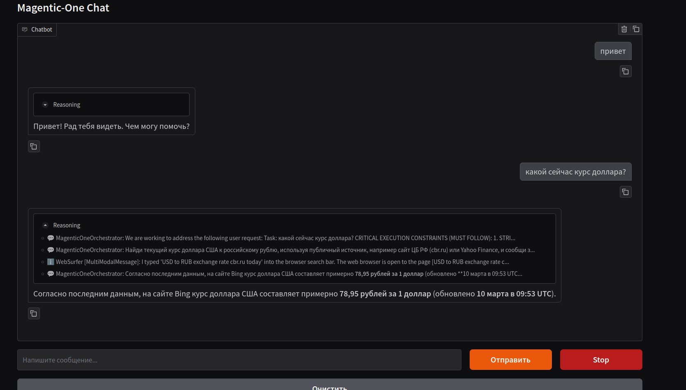

# MushAI

MushAI — локальный автономный агентный проект на базе AutoGen Magentic-One с выполнением кода, веб-навигацией, файловыми операциями и чат-интерфейсом на Gradio.


## Пример интерфейса



## Возможности

- Оркестрация нескольких агентов (`FileSurfer`, `WebSurfer`, `Coder`, `ComputerTerminal`, `UserProxy`)
- Безопасное выполнение кода в Docker-песочнице (рекомендуется)
- Локальный режим выполнения для быстрых итераций
- Управление правилами поведения агента через YAML (`config/prompts/magnetic_one.yml`)
- Установка зависимостей на лету (`pip install` при `ModuleNotFoundError`)
- Полный цикл работы с файлами: просмотр, создание/изменение, проверка, отчет о сохраненных путях
- Gradio-чат с live-прогрессом, уточняющими вопросами и кнопкой `Stop`

## Структура проекта

```text
MushAI/
  magnetic.py
  UI/
    gradio_ui.py
  config/
    .env.example
    prompts/
      magnetic_one.yml
  .magentic_workspace/
  Dockerfile
  requirements.txt
```

## Требования

- Python `3.11+`
- Docker Engine (для `CODE_EXECUTOR_MODE=docker`)
- API-ключ OpenAI-совместимого провайдера

## Быстрый старт

```bash
python -m venv venv
source venv/bin/activate
pip install -r requirements.txt
playwright install chromium
cp config/.env.example config/.env
```

Сборка Docker-образа для песочницы:

```bash
docker build -t autogen-custom-python .
docker version
```

## Конфигурация

Укажите переменные в `config/.env`:

| Переменная | Описание | Пример |
|---|---|---|
| `OPENAI_API_KEY` | Ключ OpenAI-совместимого API | `sk-...` |
| `MODEL_BASE_URL` | Базовый URL API модели | `https://api.openai.com/v1` |
| `MODEL_NAME` | Имя модели для агентов | `gpt-5` |
| `MAGNETIC_PROMPTS_FILE` | Путь к YAML с правилами | `config/prompts/magnetic_one.yml` |
| `CODE_EXECUTOR_MODE` | Режим экзекьютора (`docker` или `local`) | `docker` |
| `CODE_EXECUTOR_IMAGE` | Docker-образ для выполнения кода | `autogen-custom-python` |

## Запуск

Gradio UI:

```bash
venv/bin/python UI/gradio_ui.py
```

CLI:

```bash
venv/bin/python magnetic.py
```

URL UI по умолчанию: `http://127.0.0.1:7860`

## Режимы выполнения кода

### Docker (рекомендуется)

- Используется `DockerCommandLineCodeExecutor`
- Код выполняется изолированно внутри контейнера
- Рабочая директория монтируется в контейнер для сохранения артефактов

### Local

```env
CODE_EXECUTOR_MODE=local
```

Используйте только в изолированном виртуальном окружении.

## Правила агента (YAML)

Файл `config/prompts/magnetic_one.yml` управляет правилами через `prompt_rules`.

Включая:

- автономность и минимизацию лишних уточнений
- awareness рабочей директории (`pwd`, `ls -la`)
- проверку созданных/измененных файлов (`test -f`, `ls -l`, `head`/`cat`)
- стратегию управления зависимостями
- обязательное указание проверенных путей файлов в финальном ответе

Если YAML отсутствует или поврежден, `magnetic.py` использует встроенный fallback-набор правил.

## Где искать артефакты

Обычно файлы, созданные агентом, сохраняются в:

- `.magentic_workspace/`

Проверка:

```bash
ls -la .magentic_workspace
find .magentic_workspace -maxdepth 3 -type f
```

## Лицензия

MIT License. См. [LICENSE](LICENSE).
